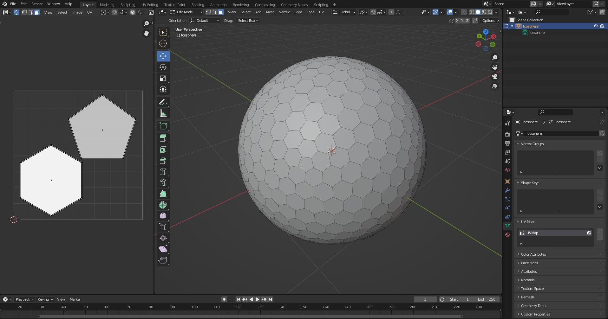
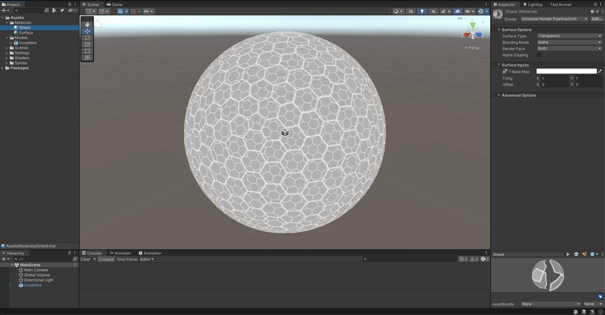

# Sci-Fi Shield Shader

Polyhedral sci-fi shield Shader implemented with HLSL/ShaderGraph and VFX Graph for the URP in **Unity 2021.3.10f1**

## Screenshots

### Table Of Contents

- [Implementation](#implementation)
  - [3D Mesh](#3d-mesh)
    - [Polyhedral Sphere](#polyhedral-sphere)
    - [UV Mapping](#uv-mapping)
    - [Import into Unity](#import-into-unity)
  - [Texture](#texture)
  - [Integrate Spaceship from Asset Store](#integrate-spaceship-from-asset-store)
  - [Shader](#shader)
    - [Pure HLSL](#pure-hlsl)
      - [Shader Lab](#shader-lab)
      - [Vertex Shader](#vertex-shader)
      - [Fragment Shader](#fragment-shader)
      - [Perlin Noise](#perlin-noise)
    - [Shader Graph](#shader-graph)
  - [VFX Graph](#vfx-graph)
  - [Collisions](#collisions)

### Resources

- [Sci-Fi Shield VFX tutorial by Gabriel Aguiar](https://www.youtube.com/watch?v=IZAzckJaSO8)
- [Star Sparrow Modular Spaceship](https://assetstore.unity.com/packages/3d/vehicles/space/star-sparrow-modular-spaceship-73167)
- [VFACE Shader Semantics](https://forum.unity.com/threads/is-it-possible-to-determine-which-vertices-are-part-of-a-backface.538187/)

## Implementation

### 3D Mesh

#### Polyhedral Sphere

- Create an **Icosphere** in **Blender** with at least 3 levels of subdivision.
- Apply a **Subdivision Modifier**.
- Select similar vertices and dissolve them.
- Make the surface only have hexagons and pentagons, like a soccer ball.


#### UV Mapping

- Delete the default UV mapping and create a new one from scratch.
- This will allow to group the faces with little distortion, and maximize overlapping.
- Generate the UV map with both hexagon and pentagon shapes in.



#### Import into Unity


### Texture

- Export the UV Mapping from blender.
- Use the UV Mapping as a reference for creating the Texture for the outlines of the shield.
- Import the texture in Unity and setup an unlit material for the shield.




### Integrate Spaceship from Asset Store

- Download the package from the asset store.
- Import the assets into the project.
- Delete any assets that are not needed.
- Setup a scene with the assets.


### Shader

#### Pure HLSL

##### Shader Lab

- Set the **RenderType** and **Queue** to **Transparent**.
- Mark the Shader to target the **UniversalRenderPipeline**.

```c
Tags {
    "RenderType" = "Transparent"
    "Queue" = "Transparent"
    "RenderPipeline" = "UniversalRenderPipeline"
}
```

- Set **Cull Off** to render both sides.
- Disable **ZWrite**.
- Implement an **Alpha Blend**.

```c
Cull Off
ZWrite Off
Blend SrcAlpha OneMinusSrcAlpha
```

- Parametrize the **MainTexture**, a **Color** for the inner faces, and the parameters for the **Fresnel** effect in the front.
- Parametrize the amount and speed of the **displacement** animation.
- Use **HDR** mode for the colors.

```c
_MainTex ("Texture", 2D) = "white" {}
[HDR] _ColorBack ("Color Back", Color) = (1,1,1,1)

_FresnelPower ("Fresnel Power", Float) = 1
[HDR] _FresnelColor ("Fresnel Color", Color) = (1,1,1,1)

_DisplacementAmount ("Displacement Amount", Float) = 1.0
_AnimationSpeed ("Animation Speed", Float) = 1.0
```

##### Vertex Shader

- Displace the vertices in the **Vertex Shader Stage**.

```c
// displace faces along the normals
float displacementAmount =  ((sin(_Time.y * _AnimationSpeed) + 1) / 2) * _DisplacementAmount;
float3 displacedPostitionOS =  IN.positionOS.xyz + (IN.normal.xyz * displacementAmount);
OUT.positionHCS = TransformObjectToHClip(displacedPostitionOS);
```

- Calculate the **world normal** and the **view dir**, for later computing the **Fresnel** in the **Fragment Shader**.

```c
float3 positionW = TransformObjectToWorld(IN.positionOS.xyz);
OUT.viewDir = normalize(_WorldSpaceCameraPos.xyz - positionW.xyz);

OUT.worldNormal = TransformObjectToWorldNormal(IN.normal.xyz, true);
```

##### Fragment Shader

- Calculate the **Fresnel** effect.

```c
// fresnelDot is zero when normal is 90 deg angle from view dir
float fresnelDot = dot(IN.worldNormal, IN.viewDir);

fresnelDot = saturate(fresnelDot); // clamp to 0,1
float fresnelPow = pow(1.0f - fresnelDot, _FresnelPower);
```

- Return the corresponding color using the **VFACE** semantics to detect if the face is facing the camera or not.

```c
// VFACE input positive for frontbaces,
// negative for backfaces. Output one
// of the two colors depending on that.
half4 frag(Varyings IN, half facing : VFACE) : SV_Target
{
    ...
    return facing > 0 ? color * fresnelPow * _FresnelColor : color * _ColorBack;
}
```


##### Perlin Noise

- Calculate a **Perlin Noise** value using the **normal.xy** coordinates.
- This way, all vertices of the same face will compute the same **Perlin Noise** value, because the faces are planar and all normals are the same for the same face.
- Multiplying this **Perlin Noise** by the displacement amount, will make individual faces move separately from the rest.
- Generating an effect of disarray.

```c
// generate perlin noise for the given UVs in the second UV map
float noise;
PerlinNoise_half(
    IN.normal.xy,
    5,
    5,
    noise,
    _Time.y * _AnimationSpeed
);

// displace faces along the normals
float displacementAmount =  noise * _DisplacementAmount;
displacementAmount = clamp(displacementAmount, -_DisplacementAmount, _DisplacementAmount);

float3 displacedPostitionOS =  IN.positionOS.xyz + (IN.normal.xyz * displacementAmount);
```


