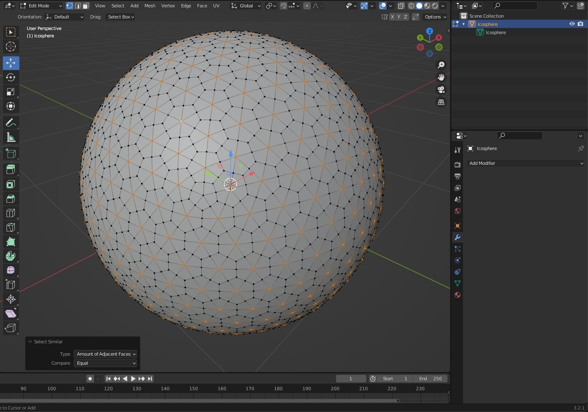
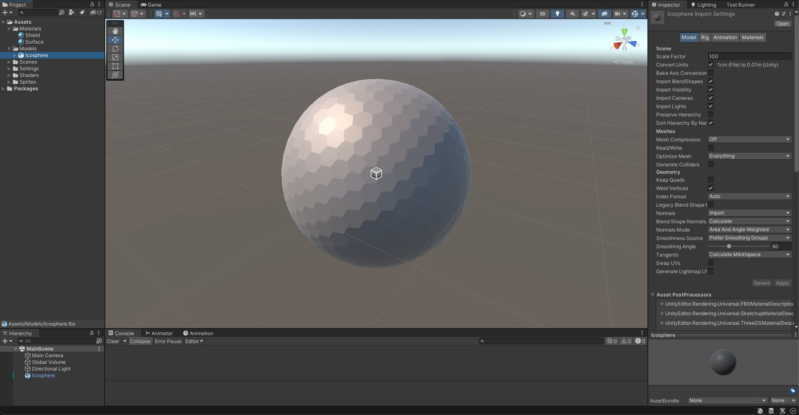

# Sci-Fi Shield Shader

Polyhedral sci-fi shield Shader implemented with HLSL/ShaderGraph and VFX Graph for the URP in **Unity 2021.3.10f1**

## Screenshots

### Table Of Contents

- [Implementation](#implementation)
  - [3D Mesh](#3d-mesh)
    - [Polyhedral Sphere](#polyhedral-sphere)
    - [UV Mapping](#uv-mapping)
    - [Import into Unity](#import-into-unity)

### References

- [Sci-Fi Shield VFX tutorial by Gabriel Aguiar](https://www.youtube.com/watch?v=IZAzckJaSO8)

## Implementation

### 3D Mesh

#### Polyhedral Sphere

- Create an **Icosphere** in **Blender**.
- Apply a **Subdivision Modifier**.
- Select similar vertices and dissolve them.
- Make the surface only have hexagons and pentagons, like a soccer ball.

#### UV Mapping

- Delete the default UV mapping and create a new one from scratch.
- This will allow to group the faces with litte distortion, and maximize overlapping.
- Generate the UV map with both hexagon and pentagon shapes in.

#### Import into Unity

